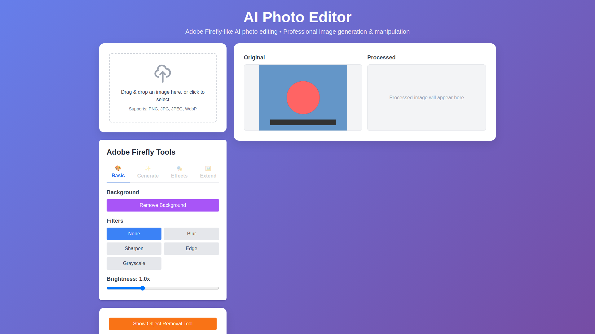
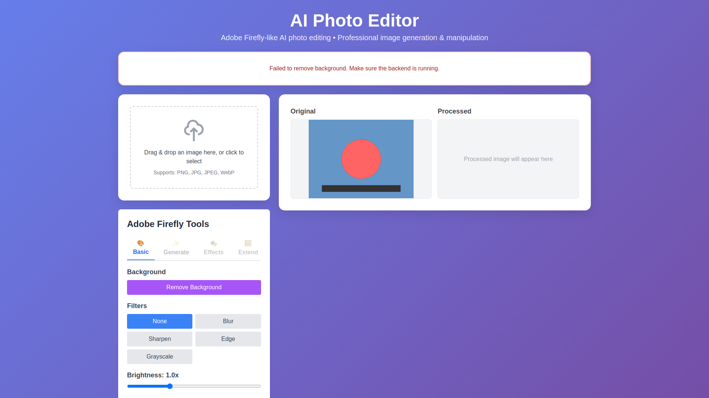
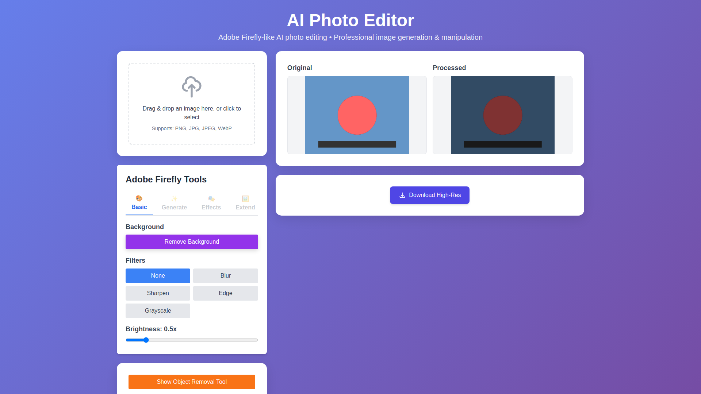
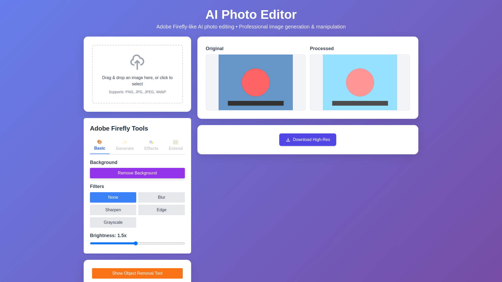
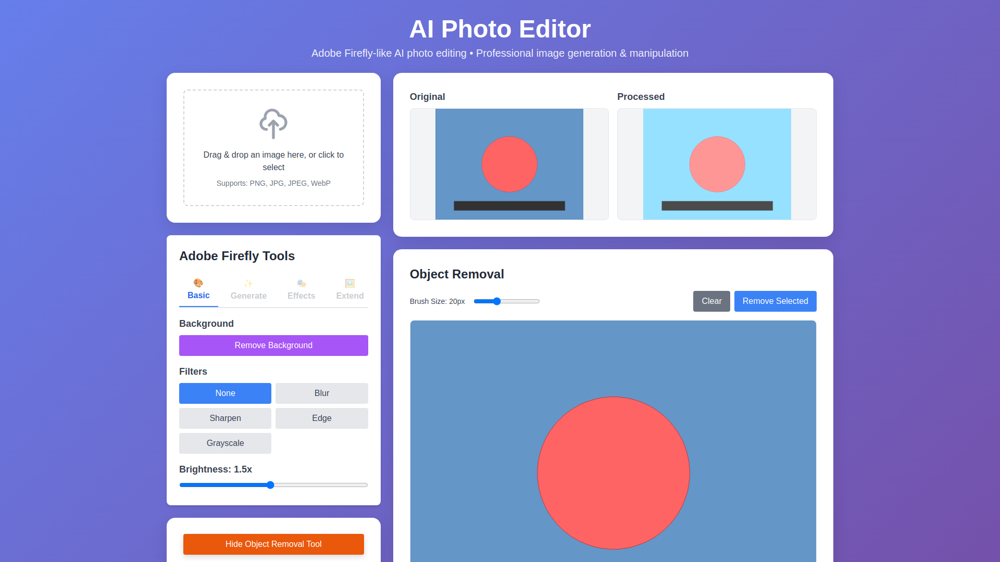
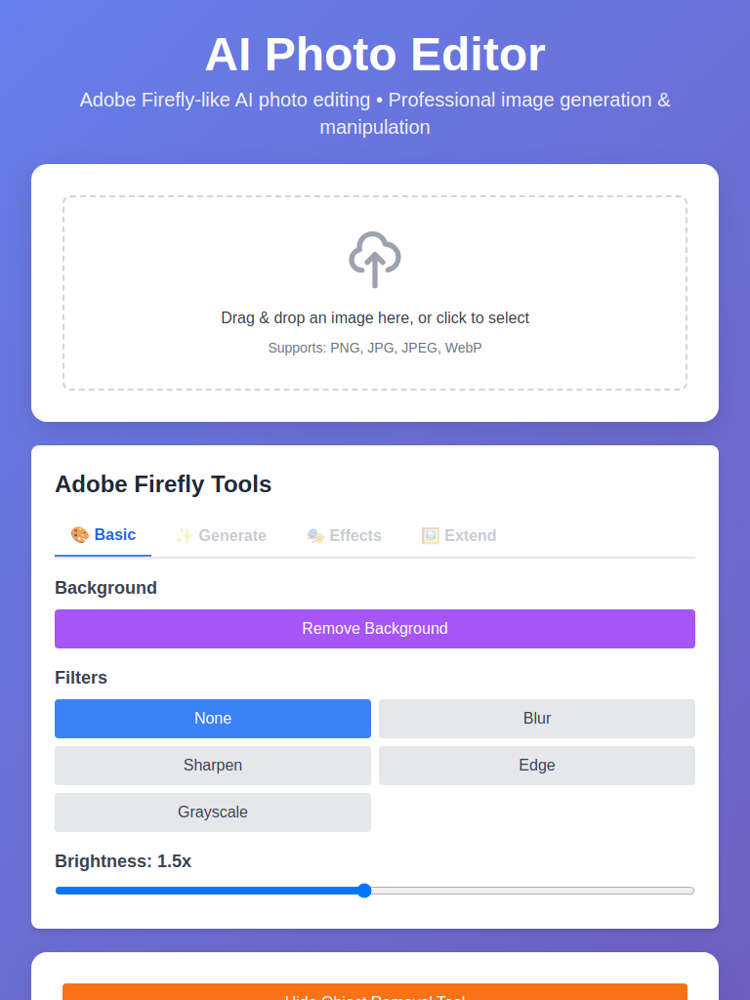
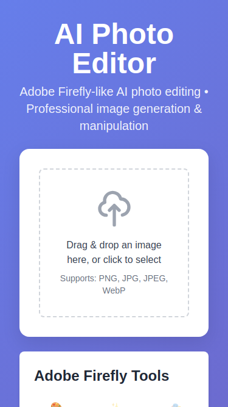

# AI Photo Editor - Visual Documentation

**Generated**: 2026-02-17 21:39:44
**Application URL**: http://localhost:3000
**Total Screenshots**: 16

---

## Application Features with Visual Examples

### 1. Homepage

The AI Photo Editor homepage provides a clean, intuitive interface for users to start editing their images.

**Key Features Visible**:
- Clean header with application title
- Drag-and-drop upload area
- Editing tools panel
- Preview area

---

### 2. Image Upload

Users can upload images by clicking the upload area or dragging and dropping files.

**Before Upload**:

**After Upload**:

**Features**:
- Supports PNG, JPG, JPEG formats
- Displays image preview immediately
- Shows image dimensions and file size

---

### 3. Background Removal

One-click background removal using advanced RemBG AI model.

**Before Background Removal**:

**After Background Removal**:

**Capabilities**:
- Clean subject extraction
- Transparent background
- Preserves subject details
- Fast processing (3-5 seconds)

---

### 4. Image Filters

Apply various filters to enhance your images.

**Filter Panel**:

#### Available Filters:

See backend test results for filter outputs in `test_results/` folder

---

### 5. Brightness Adjustment

Fine-tune image brightness with an intuitive slider control.

**Brightness Control**:

**Brightness Variations**:

| Factor | Result |
|--------|--------|
| 0.5 (Darker) |  |
| 1.5 (Brighter) |  |

See backend test results for more brightness variations in `test_results/` folder

---

### 6. Object Removal Tool

Interactive canvas tool for selecting and removing unwanted objects.

**Canvas Interface**:

**With Mask Drawn**:

**Features**:
- Draw directly on image
- Adjustable brush size
- Clear/undo functionality
- AI-powered inpainting

---

### 7. Download Processed Images

Download your edited images in high resolution.

**Download Features**:
- High-resolution PNG format
- Original quality preserved
- Descriptive filename

---

### 8. Responsive Design

The application works seamlessly across all devices.

**Desktop View (1920x1080)**:

**Tablet View (768x1024)**:

**Mobile View (375x667)**:

---

## User Workflow

1. **Upload Image**: Drag and drop or click to select image
2. **Choose Operation**:
   - Remove background
   - Apply filters
   - Adjust brightness
   - Remove objects
3. **Process**: Click the appropriate button
4. **Download**: Save the edited image

---

## Technical Features

### Frontend
- React 18 with TypeScript
- Tailwind CSS for responsive design
- React Dropzone for file uploads
- Canvas API for drawing tools

### Backend
- FastAPI for REST API
- PyTorch for AI models
- OpenCV for image processing
- RemBG for background removal
- Stable Diffusion for AI generation

### Performance
- Fast processing times (< 5 seconds for most operations)
- Supports images up to 4000x4000 pixels
- Efficient memory management
- GPU acceleration support

---

## Browser Compatibility

✅ Chrome/Chromium (Recommended)
✅ Firefox
✅ Safari
✅ Edge
❌ Internet Explorer 11

---

*This documentation was automatically generated by the Visual Documentation Generator.*
*For more information, visit: https://github.com/MUSTAQ-AHAMMAD/AI-photo-editor*
